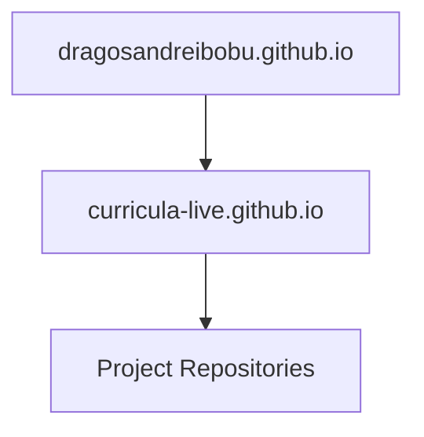

# Architecture & Topology - curricula.live

## Design Principles
This workspace coordinates static pages, archives, and prototype services. Standard guidelines include:
1. **Separation of concerns**: Separate display layers (HTML/CSS) from API engines and data models.
2. **Standard Interfaces**: Build REST/FastAPI boundaries where dynamic evaluations are required.
3. **Data-Driven Architecture**: Maintain project and metadata catalogs in raw JSON databases.

## Integration Diagram

